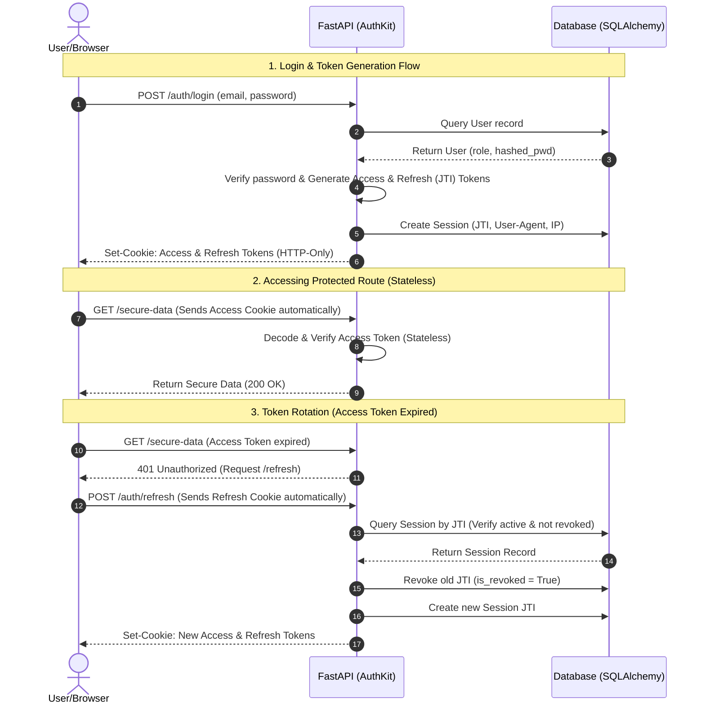
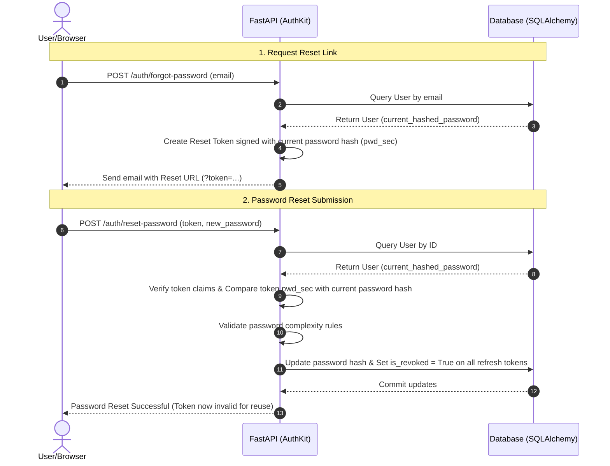

# AuthKit FastAPI

A highly secure, reusable, database-backed authentication, user management, and audit logging plugin for FastAPI. Exposes standard JSON API endpoints, secures routes via role-based dependency injections, and renders a stunning out-of-the-box HTML admin dashboard.

---

## Key Features

*   **Dual-Token JWT Security**: Uses short-lived Access JWTs and long-lived Refresh JWTs. Checked in HTTP-only cookies first (highly secure for web applications) with Bearer Header fallback (for APIs and mobile applications).
*   **Database Session Revocation**: Stores active refresh tokens securely (SHA-256 hashed) in the database. Allows users to sign out of single devices or revoke all sessions across all devices.
*   **Built-in Glassmorphic Admin Dashboard**: Serves a premium dark-themed visual user administration panel. Admin users can activate/deactivate user accounts, change roles, inspect and search system audit logs, and revoke active device sessions.
*   **Hybrid Audit Trail Logging**: Automatically records all security events (successful/failed logins, registrations, password resets) and exposes a helper function for host applications to record custom actions.
*   **SQLite & Supabase (Postgres) Compatibility**: Built-in safeguards including dynamic UUID-as-String columns, event listeners to enforce foreign keys on SQLite, and generic JSON structures.
*   **CLI Scaffolding Tool**: Spin up a fully configured authentication architecture in any project in seconds using `authkit init`.

---

## Installation

Install the package directly into your virtual environment:

```bash
pip install authkit-fastapi
```

Or using `uv`:

```bash
uv add authkit-fastapi
```

---

## Getting Started: Bootstrap in 3 Steps

### Step 1: Initialize code scaffolding
Run the initializer command in the root of your new project:

```bash
authkit init
# or
uv run authkit init
```

This scaffolds a local `auth/` module and pre-fills environment files:
```text
project-root/
├── .env                               # Active configuration values (ignored in git)
├── .env.example                       # Configuration template
└── auth/                              # Local Auth Module
    ├── __init__.py
    ├── setup.py                       # SQLAlchemy engine & AuthKit instantiation
    ├── models.py                      # Subclassable database tables
    └── schemas.py                     # Extensible validation schemas
```

### Step 2: Configure variables
Review the generated `.env` file. A strong random secret key is automatically generated for you:
```env
AUTHKIT_SECRET_KEY=e83d8a9f23...
AUTHKIT_DATABASE_URL=sqlite+aiosqlite:///./authkit.db
AUTHKIT_COOKIE_SECURE=False
AUTHKIT_COOKIE_SAMESITE=lax
```
*Note: For production (e.g. Supabase Postgres), change `AUTHKIT_DATABASE_URL` to `postgresql+asyncpg://...` and set `AUTHKIT_COOKIE_SECURE=True`.*

### Step 3: Mount in your FastAPI app
In your main FastAPI entry point (e.g. `main.py`), import the bootstrapped module and mount the routers:

```python
from fastapi import FastAPI
from auth import auth_kit, init_db

app = FastAPI(title="My AI Application")

# Mount JSON endpoints (register, login, refresh, logout, profile)
app.include_router(auth_kit.router, prefix="/auth", tags=["Authentication"])

# Mount Visual HTML Admin Dashboard
app.include_router(auth_kit.admin_router, prefix="/admin", tags=["Admin Panel"])

@app.on_event("startup")
async def startup():
    # Automatically creates SQLite tables if they do not exist
    await init_db()
```

Run your server:
```bash
uvicorn main:app --reload
```
You can now access:
1.  Interactive Swagger API Docs: `http://127.0.0.1:8000/docs`
2.  Visual Admin Dashboard: `http://127.0.0.1:8000/admin` (to log in, create a user and set their role to `"admin"` in the database).

---

## Integrating with Existing Projects (Manual Setup)

If you already have an existing project with defined database models and configurations, you do not need to use `authkit init`. You can integrate the prebuilt routers and mixins directly.

### Step 1: Mixin Auth Columns into Your SQLAlchemy Models
Import the SQLAlchemy base mixins and mix them into your existing models in your `models.py` file:

```python
from sqlalchemy import Column, String
from database import Base  # Your existing declarative base
from authkit_fastapi.models import BaseUserMixin, BaseRefreshTokenMixin, BaseAuditLogMixin

# 1. Mix fields into your existing User model
class User(BaseUserMixin, Base):
    __tablename__ = "users"
    
    # Your existing columns
    full_name = Column(String(100), nullable=True)

# 2. Inherit RefreshToken and AuditLog models
class RefreshToken(BaseRefreshTokenMixin, Base):
    __tablename__ = "refresh_tokens"

class AuditLog(BaseAuditLogMixin, Base):
    __tablename__ = "audit_logs"
```

### Step 2: Initialize AuthKit
Create your configuration and instantiate `AuthKit` passing your existing session maker and models:

```python
from authkit_fastapi import AuthKit, AuthKitConfig
from database import async_session_maker  # Your existing async session maker
from models import User, RefreshToken, AuditLog

config = AuthKitConfig(
    secret_key="your-secure-secret-key",
    cookie_secure=True,  # Set to True in production (HTTPS)
)

auth_kit = AuthKit(
    config=config,
    db_session_maker=async_session_maker,
    user_model=User,
    refresh_token_model=RefreshToken,
    audit_log_model=AuditLog
)
```

### Step 3: Mount Routers in FastAPI
Mount the prebuilt JSON endpoints and the Admin Dashboard routers directly inside your application:

```python
from fastapi import FastAPI
from setup_auth import auth_kit  # Import the instance from Step 2

app = FastAPI()

# Mount all JSON APIs (/auth/login, /auth/register, /auth/logout, etc.)
app.include_router(auth_kit.router, prefix="/auth", tags=["Auth"])

# Mount HTML Admin dashboard (/admin, /admin/dashboard, etc.)
app.include_router(auth_kit.admin_router, prefix="/admin", tags=["Admin Dashboard"])
```

---

## Usage Guide

### Protecting Host Application Routes
Secure your own application endpoints using `Depends` along with AuthKit dependencies:

```python
from fastapi import FastAPI, Depends
from auth import auth_kit

app = FastAPI()

# 1. Require any active authenticated user
@app.get("/profile")
def read_profile(user = Depends(auth_kit.current_active_user)):
    return {"email": user.email, "role": user.role}

# 2. Restrict to Administrators only
@app.get("/system-settings")
def admin_settings(admin = Depends(auth_kit.current_admin)):
    return {"message": "Welcome back admin", "admin_id": admin.id}

# 3. Dynamic role requirements
@app.get("/moderation-queue")
def moderation_queue(user = Depends(auth_kit.requires_role("moderator"))):
    return {"status": "ok", "moderated_by": user.email}

# 4. Multi-role checks
@app.get("/editor-panel")
def editor_panel(user = Depends(auth_kit.requires_roles(["admin", "editor"]))):
    return {"message": "Granted access to editor/admin panel"}
```

### Extending Database Tables
If you need to add custom columns to the `User` table (e.g., `full_name`, `organization_id`), simply edit the generated `auth/models.py` file:

```python
# auth/models.py
from sqlalchemy import String, mapped_column
from authkit_fastapi.models import Base, BaseUserMixin

class User(Base, BaseUserMixin):
    __tablename__ = "users"
    
    # Custom fields added here!
    full_name: Mapped[str] = mapped_column(String(100), nullable=True)
    organization_id: Mapped[Optional[str]] = mapped_column(String(50), nullable=True)
```
Don't forget to update your Pydantic schemas in `auth/schemas.py` to match:
```python
# auth/schemas.py
from authkit_fastapi.schemas import UserCreate, UserRead

class CustomUserCreate(UserCreate):
    full_name: Optional[str] = None

class CustomUserRead(UserRead):
    full_name: Optional[str]
```

### Writing Custom Audit Logs
Keep track of critical operations in your app by using the hybrid audit logger:

```python
from fastapi import FastAPI, Depends, Request
from sqlalchemy.ext.asyncio import AsyncSession
from auth import auth_kit

app = FastAPI()

@app.post("/train-ai-model")
async def run_ai(
    request: Request,
    db: AsyncSession = Depends(auth_kit.get_db),
    user = Depends(auth_kit.current_active_user)
):
    # Perform operation...
    
    # Audit log entry created automatically with user ID, IP address, and User-Agent
    await auth_kit.log_action(
        db=db,
        action="trained_ai_model",
        user_id=user.id,
        details={"model_type": "Transformer", "epochs": 10},
        request=request
    )
    
    return {"success": True}
```

---

## Local Sandbox Verification

A pre-packaged sandbox app is provided in the repository for quick testing.

1.  Sync dependencies: `uv sync`
2.  Run the sandbox: `uv run python examples/main.py`
3.  Log in as admin:
    *   Navigate to `http://127.0.0.1:8000/admin`
    *   Use email `admin@example.com` and password `adminpass123`.

### Running Tests
To run the automated `pytest` test suite:
```bash
uv run pytest
```

---

## AuthKit Architecture: Explained Simply

To help you understand how AuthKit secures your application under the hood, here is a detailed breakdown of the token lifecycle, database session tracking, and the password reset flow.

### 🎭 The Real-World Analogy: The Amusement Park

*   **Access Token (The Daily Ride Wristband)**: 
    When you enter the amusement park, you get a colored paper wristband for the day. At every ride (endpoint), the ride operator (server middleware) just looks at your wristband to verify today's color. They don't check a computer database. It's extremely fast and easy. However, the wristband expires at the end of the day (short-lived Access Token) so you can't reuse it tomorrow.
*   **Refresh Token (The Annual Season Pass Card)**: 
    To get a new daily wristband tomorrow, you go to the ticket booth (the `/refresh` endpoint) and scan your Season Pass Card (Refresh Token). The ticket booth agent checks the computer database (database lookup) to verify your season pass is active, paid, and has not been reported lost or stolen. If it is valid, they issue you a new daily wristband (Access Token) and rotate your Season Pass Card (Refresh Token JTI) for safety.
*   **Revocation (Reporting the Card Lost/Stolen)**: 
    If you lose your season pass, you report it. The park flags it as blocked (revoked) in the computer database. If someone else tries to use that season pass to get a wristband, the computer rejects it instantly, even if the expiration date on the card is still in the future.

---

### 1. Token & Session Lifecycle (Login, Access, and Refresh)

This sequence diagram illustrates the steps when a user logs in, accesses a protected API statelessly, and requests new tokens when their access token expires:



#### Under the Hood:
1.  **Login**: On successful authentication, AuthKit generates two JWTs: an **Access Token** (short lifespan) and a **Refresh Token** (long lifespan containing a unique random ID called `jti`).
2.  **Session Record**: The `jti` is hashed (SHA-256) and saved in the database `RefreshToken` table along with the user's IP address and User-Agent.
3.  **HTTP-Only Cookies**: Both tokens are set in the user's browser using secure, `HttpOnly`, `SameSite=Lax` cookies so JavaScript scripts cannot steal them.
4.  **Token Rotation**: When the Access Token expires, the client calls `/auth/refresh`. AuthKit inspects the Refresh Token, queries the database to verify the `jti` session record is not expired or marked `is_revoked = True`. If valid, it revokes the old session and issues brand new Access and Refresh tokens to prevent token reuse attacks.

---

### 2. Single-Use Password Reset Flow

This sequence diagram explains how AuthKit sends a password reset link and guarantees it cannot be reused (is strictly single-use) without creating extra database state:



#### Under the Hood:
1.  **Link Request**: The user submits their email. AuthKit reads their current `hashed_password` from the database.
2.  **Cryptographic Signature (`pwd_sec`)**: It hashes a segment of the current password hash and places it inside the JWT payload as `pwd_sec`. The reset link is sent to the user's email.
3.  **Submission & Verification**: When the user opens the link and submits a new password, the server decodes the token, fetches the user, and compares the token's `pwd_sec` against the user's *current* database password hash.
4.  **Immediate Invalidation**: Once the password is reset, the user's password hash in the database is updated. If the user clicks the reset link in the email again, the token's `pwd_sec` will no longer match the user's new password hash, causing the validation to fail immediately.
5.  **Session Cleanup**: Updating the password automatically revokes all other active device sessions (sets `is_revoked = True` for all of the user's refresh tokens) for maximum account security.
